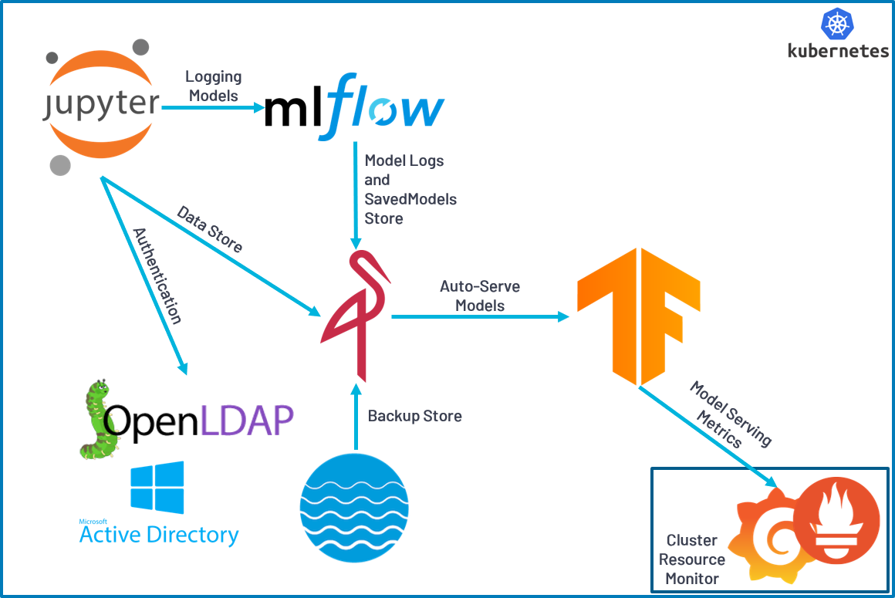

Kountertop is an ML toolkit that integrates the best-of-breed open-source ML systems to address the Build-Train-Serve workflow in Machine Learning.

 * Features a centralized model building and experimentation platform
 * High performance, high availability, model versioning supported ML model serving platform
 * Abstracts complexities away from Data Scientists
 * Auto-serving capability

## Overview

1. [System Architecture](#system-architecture)

2. [How to Install](#how-to-install)

## System Architecture


## How to install

We will be using MicroK8S, but you can configure it to use with any other Kubernetes provider as well!

Clone this repository to your `$HOME` directory

```
git clone https://github.com/sachua/kountertop.git
```

If you are installing on-prem, run the scripts to push the images to your local registry

```bash
cd on-prem
sh pull_images.sh
sh push_images.sh
```
    
* You should then change all the image paths of the different components to point to your private registry

Enable MicroK8s add-ons

```bash
microk8s enable dns storage metrics-server metallb prometheus helm3
```

### Installation

1. Deploy MinIO

    ```bash
    helm install minio ./minio.tgz
    ```

    * Create the buckets ```mlflow``` and ```config```

    * Copy ```models.config``` and ```prometheus.config``` in [tensorflow-serving](./tensorflow-serving) to the ```config``` bucket

2. Deploy MLflow

    ```bash
    kubectl apply -f mlflow-mysql-deployment.yaml
    kubectl apply -f mlflow-ui-deployment.yaml
    ```

3. Deploy OpenLDAP

    ```bash
    kubectl apply -f LDAP-server.yaml
    ```

    * Create user-accounts based on examples from ```LDAP users & groups```

    * To seed LDAP with entries:

        ```bash
        kubectl exec -it -n kubeflow ldap-0 -- bash
        ldapadd -x -D "cn=admin,dc=example,dc=com" -W
        # Enter password "admin".
        # Press Ctrl+D to complete after pasting the snippets.
        ```

4. Deploy Jupyterhub

    ```bash
    helm install jhub ./jupyterhub.tgz \
    --version=0.9.0 \
    --values config.yaml
    ```
    
    * Template for using AD instead of OpenLDAP is provided in [AD-config](AD-config.yaml)
    
5. Deploy Tensorflow Serving

    ```bash
    kubectl apply -f tfserving-deployment.yaml
    ```

6. Deploy Velero

    ```bash
    tar -xzvf velero.tgz
    export PATH=$PATH:"/$HOME/kountertop"
    velero install \
     --provider aws \
     --plugins velero/velero-plugin-for-aws:v1.1.0 \
     --bucket velero \
     --secret-file ./credentials-velero \
     --use-volume-snapshots=false \
     --backup-location-config region=minio,s3ForcePathStyle="true",s3Url=http://minio.default.svc.cluster.local:9000
    ```
    
    * if minio not recognized, use the plain endpoint address instead (e.g. http://<span></span>host:port) 

7. Configure Prometheus to take config from Tensorflow Serving

    * Change `targets` in [prometheus-additional.yaml](prometheus-additional.yaml) to point at the Tensorflow Serving REST endpoint

    * Create a secret out of the configuration

        ```bash
        kubectl create secret generic additional-scrape-configs --from-file=prometheus-additional.yaml -n monitoring -oyaml > additional-scrape-configs.yaml
        ```

    * Reference this additional configuration in your Prometheus Configuration

        ```bash
        kubectl edit prometheus k8s -n monitoring
        ```

        ```bash
        apiVersion: monitoring.coreos.com/v1
        kind: Prometheus
        metadata:
        name: prometheus
        labels:
            prometheus: prometheus
        spec:
        replicas: 1
        serviceAccountName: prometheus
        serviceMonitorSelector:
        additionalScrapeConfigs:
            name: additional-scrape-configs
            key: prometheus-additional.yaml
        ...
        ```
### Jupyter Notebook Logging to MLflow
The default minimal notebook image is already integrated with MLflow

To use the MLflow loggin feature for custom notebooks, you can build your own jupyter image from `sachua/jupyter-mlflow:latest` and install your own packages

Alternatively, install MLflow in your custom notebook:
* Add the code to a cell in your Jupyter Notebook

    ```bash
    %%capture
    !pip install --upgrade pip --user
    !pip install mlflow[extras] --user
    %env MLFLOW_TRACKING_URI=http://host:port
    %env MLFLOW_S3_ENDPOINT_URL=http://host:port
    %env AWS_ACCESS_KEY_ID=minio
    %env AWS_SECRET_ACCESS_KEY=minio123
    ```

    * Replace http://<span></span>host:port with your MLflow endpoint and MinIO endpoint

    * Check endpoints with `kubectl get svc -A`
